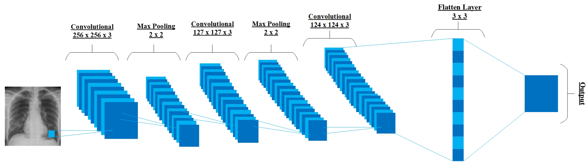
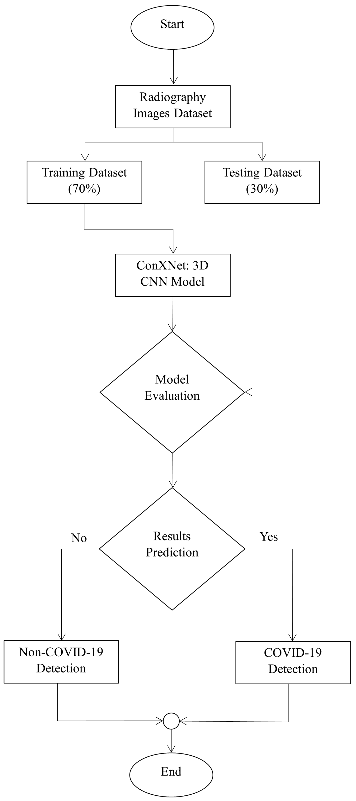
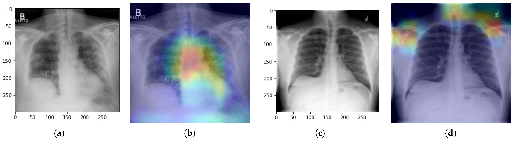

# Neural Networks for the Detection of COVID-19 and Other Diseases: Prospects and Challenges

Official repository accompanying the review paper: **"Neural Networks for the Detection of COVID-19 and Other Diseases: Prospects and Challenges"**

**Authors:** Muhammad Azeem, Shumaila Javaid, Ruhul Amin Khalil, Hamza Fahim, Turke Althobaiti, Nasser Alsharif, and Nasir Saeed 

**Institution:** University of Salford, Manchester, England, UK.  

**DOI:** (https://doi.org/10.3390/bioengineering10070850)

---

## Abstract
Artificial neural networks (ANNs) ability to learn, correct errors, and transform a large amount of raw data into beneficial medical decisions for treatment and care has increased in popularity for enhanced patient safety and quality of care. Therefore, this paper reviews the critical role of ANNs in providing valuable insights for patients’ healthcare decisions and efficient disease diagnosis. We study different types of ANNs in the existing literature that advance ANNs’ adaptation for complex applications. Specifically, we investigate ANNs’ advances for predicting viral, cancer, skin, and COVID-19 diseases. Furthermore, we propose a deep convolutional neural network (CNN) model called ConXNet, based on chest radiography images, to improve the detection accuracy of COVID-19 disease. ConXNet is trained and tested using a chest radiography image dataset obtained from Kaggle, achieving more than 97% accuracy and 98% precision, which is better than other existing state-of-the-art models, such as DeTraC, U-Net, COVID MTNet, and COVID-Net, having 93.1%, 94.10%, 84.76%, and 90% accuracy and 94%, 95%, 85%, and 92% precision, respectively. The results show that the ConXNet model performed significantly well for a relatively large dataset compared with the aforementioned models. Moreover, the ConXNet model reduces the time complexity by using dropout layers and batch normalization techniques. Finally, we highlight future research directions and challenges, such as the complexity of the algorithms, insufficient available data, privacy and security, and integration of biosensing with ANNs. These research directions require considerable attention for improving the scope of ANNs for medical diagnostic and treatment applications.

---

## Key Contributions
* **Comprehensive Multi-Disease Taxonomy:** Outlines the application of modern ANN frameworks across various modalities for infectious diseases (COVID-19) and non-communicable conditions (malignancies, dermatological diseases).
* **Multi-Modal Diagnostic Survey:** Evaluates and contrasts image-based diagnostics (X-Rays, CT scans, ultrasound) against non-image-based inputs (blood biomarkers, clinical text, and epidemiological series).
* **In-Depth Challenge Mapping:** Systematically classifies technical bottlenecks into four critical dimensions: algorithm selection, computational complexity, data deficiency/scarcity, and biosensing system integration.
* **ConXNet Architecture:** Proposes a custom, highly accurate 4-block Convolutional Neural Network leveraging specialized feature maps, batch normalization, and nonlinear activation strategies optimized for medical imagery.
* **Robust Multi-Source Evaluation:** Validates the proposed model across structurally diverse, authentic clinical datasets comprising over 17,000 images sourced from international clinics, Kaggle, GitHub, and academic databases.
* **Future Deployment Horizons:** Synthesizes actionable research directions such as network pruning, data augmentation standards, and standardized privacy-preserving mechanisms for real-world clinical integration.

---

## Technical Overview
The paper tracks the end-to-end integration of artificial neural networks within medical diagnostic pipelines:

1. **Data Acquisition & Pre-processing:** Collection of heterogeneous modalities including Computed Tomography (CT), chest X-rays, ultrasound imaging, and biochemical blood profiles.
2. **Feature Extraction:** Leveraging Deep Convolutional Neural Networks (CNNs) and Hybrid Architectures to extract spatial and structural markers from clinical inputs.
3. **Classification & Segmentation:** Deploying supervised, unsupervised, and deep transfer learning algorithms to isolate lesions, classify disease severity, or predict epidemiological spread.
4. **Optimization Mechanisms:** Exploring methods like dropout layers, network pruning, and data transformation strategies to maximize accuracy while mitigating resource consumption.

---

## Method Overview: The ConXNet Model
### 1. ConXNet Architecture
The ConXNet model is engineered out of **four core sequential blocks**. Each block features a structural layout designed to extract features robustly while preventing internal covariate shifts:
* **Convolutional Layer (Conv):** Extracts low-to-high level spatial features (edges, soft boundaries, textures) via filter matrices.
* **Rectified Linear Unit (ReLU):** Implements non-linear mappings, forcing the network to lean non-negative linear values.
* **Batch Normalization (BN):** Stabilizes training trajectories and aggressively prevents overfitting.
* **MaxPooling Layer:** Performs spatial downsampling to retain only the most prominent structural elements.

The output maps are ultimately flattened and fed into a fully connected Dense Layer followed by a binary output classifier.

   
  <em>Structural workflow of the proposed ConXNet model for COVID-19 detection.</em>

### 2. Algorithmic Flowchart
The diagnostic implementation handles balanced sampling, data splitting ($70\%$ training, $30\%$ validation), forward feature extraction, adaptive optimization, and final output categorization.

   
  <em>End-to-end flowchart of the proposed diagnostic algorithm.</em>

---

## Installation & Setup

We recommend utilizing an Anaconda environment to manage dependencies and reproducibility.

conda create -n neural-disease-det python=3.10 -y  
conda activate neural-disease-det  
pip install -r requirements.txt  

---

## Dataset

**Primary Dataset:** The ConXNet model was evaluated on a primary dataset of 13,808 chest X-ray images, comprising 3,616 COVID-19 and 10,192 non-COVID-19 samples.

**Multi-Source Validation:** To ensure clinical robustness, the dataset was augmented with 3,615 additional chest X-rays sourced from a podcast dataset, a German medical school, Kaggle, and GitHub.

**Evaluation Objective:** Integrating these diverse, authentic clinical scenarios allowed for a thorough assessment of the proposed model's real-world reliability, performance, and generalizability.

* **File Structure**   
              ├── data/  
              │    ├── Test/  
              │    │      ├── Covid  
              │    │      └── Normal  
              │    └── Train/  
              │    │      ├── Covid  
              │    │      └── Normal 

---

## Experimental Results
### Quantitative Results

  
| Model Architecture | Accuracy (↑) | Precision (↑) | F1-Score (↑) | Epochs |
| :--- | :---: | :---: | :---: | :---: |
| VGG-16 Baseline | 91.20% | 90.85% | 91.00% | 50 |
| ResNet-50 Baseline | 94.45% | 94.10% | 94.22% | 50 |
| **Proposed ConXNet** | **97.80%** | **97.93%** | **97.92%** | **100** |

## Visual Results

   
  <em>Images used to evaluate the model accuracy with their outputs (a). Original image of COVID-19 patient (b). Heat map view of COVID-infected region. (c) Original image of the normal patient (d). Heat map view of the normal image.</em>

---

## Citation

@article{azeem2023neural,
          title={Neural Networks for the Detection of COVID-19 and Other Diseases: Prospects and Challenges},  
          author={Azeem, Muhammad and Javaid, Shumaila and Khalil, Ruhul Amin and Fahim, Hamza  and Althobaiti, Turke and Alsharif, Nasser and Saeed, Nasir},  
          journal={Bioengineering},  
          volume={10},  
          number={7},  
          pages={850},  
          year={2023},  
          publisher={MDPI},  
          doi={10.3390/bioengineering10070850}  
}
